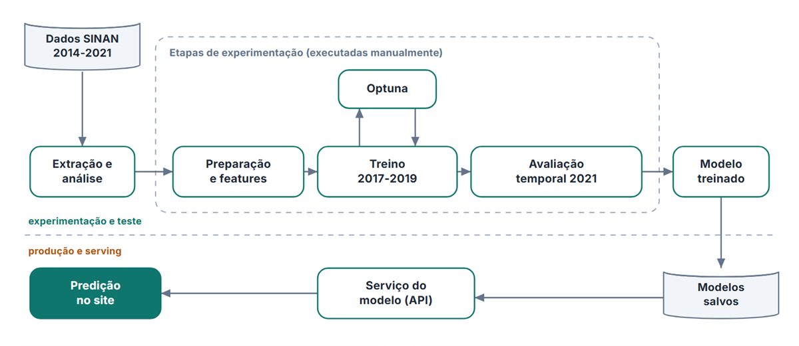

# Angel Mansilla

**Machine Learning Engineer** · Ciência da Computação na UFRJ · Rio de Janeiro

Levo modelos de Machine Learning do dado bruto até a produção: pipeline de dados, modelagem, avaliação rigorosa e a API que entrega o resultado.

  
  
  
  

---

### Sobre mim

- **Hoje:** estagiário de Machine Learning Engineering na **Genesis Data Culture**. Desenvolvo modelos de predição de falhas em equipamentos elétricos e a estrutura para treiná-los e servi-los: pipelines de dados industriais em PostgreSQL, APIs de treino e inferência em FastAPI, versionamento no MLflow e armazenamento no MinIO.
- **Formação:** Ciência da Computação na UFRJ (2023–2027), CR 8,1/10. Membro da equipe de desenvolvimento da UFRJ Analytica.
- **Interesses:** métodos ensemble, detecção de anomalias, NLP e MLOps.

### Como eu trabalho

- **Validação que imita o mundo real:** separo treino, validação e teste no tempo e procuro vazamento de dados antes de confiar em qualquer métrica.
- **Reprodutibilidade:** pipelines versionados, artefatos validados por esquema e hash, experimentos rastreados.
- **Entrega:** um modelo só gera valor quando alguém usa. API, interface e documentação fazem parte do projeto.

---

### Projeto em destaque

#### [Classificador Epidemiológico de Arboviroses](https://github.com/Ang3k/Dengue-Ensembler-Classifier)

Na notificação de um caso suspeito, dengue e chikungunya se confundem e a confirmação laboratorial demora. Este projeto prevê a confirmação usando **apenas o que se sabe no momento da notificação**, a partir de dados públicos do SINAN, para apoiar a triagem.

| 11,4 mi | 107 | 940.304 | 87,3% |
|:---:|:---:|:---:|:---:|
| registros processados | features | notificações no teste de 2021 | recall do ensemble |

- **Dados:** pipeline reproduzível de download, ETL e auditoria de 2014 a 2021, com snapshot, esquemas e hashes versionados.
- **Modelagem:** ensemble ponderado de MLP (PyTorch), XGBoost e LightGBM, com hiperparâmetros otimizados no Optuna.
- **Avaliação:** treino em 2017–2019, ajuste em 2020 e teste final em 2021, sem nenhum dado de exame ou desfecho do caso avaliado. Limiar escolhido para priorizar sensibilidade (ROC-AUC 0,829).
- **Entrega:** API em FastAPI e interface em React com simulação de casos reais anonimizados.

  

  <a href="https://github.com/Ang3k/Dengue-Ensembler-Classifier"><b>Código</b></a> ·
  <a href="https://angelmansilla.com.br/apps/dengue/"><b>Demo ao vivo</b></a> ·
  <a href="https://angelmansilla.com.br/projetos/dengue/index.html"><b>Estudo de caso</b></a>

`Python` `PyTorch` `XGBoost` `LightGBM` `Optuna` `FastAPI` `React`

---

### Outros projetos

| Projeto | O que faz | Resultado |
|---|---|---|
| **[Risco de Crédito · Home Credit](https://angelmansilla.com.br/projetos/home-credit/index.html)** | Prevê atraso no pagamento de crédito com LightGBM, seguindo CRISP-DM e tratando o desbalanceamento das classes. | AUC de 0,719 para **0,764**; 218 inadimplentes a mais identificados em 30.752 previsões |
| **[Detector de Anomalias do PC](https://github.com/Ang3k/CPU-Temperature-Anomaly-Detector)** | App desktop que coleta sensores em tempo real e aprende o padrão de temperatura com regressores ou um autoencoder convolucional. | Monitoramento contínuo com alertas no Windows quando a temperatura foge do padrão |
| **[Indústria Cinematográfica · IMDb e TMDB](https://github.com/Ang3k/Analise-SQL-da-Industria-Cinematografica-com-IMDb-e-TMDB)** | Pipeline em Python e MySQL para converter e analisar as bases públicas do IMDb e do TMDB. | **158 mi** de registros (12,7 GB), 13 análises em SQL e painéis no Power BI |
| **[Resenhex](https://github.com/Ang3k/Resenhex-The-Better-Discord)** | Plataforma de chat, voz, vídeo e compartilhamento de tela em tempo real, com app desktop que se atualiza sozinho. | Publicado na **Microsoft Store** |
| **[Churn Bancário](https://github.com/Ang3k/Exploracao-Preditiva-de-Dados-para-Churn-de-Clientes-Bancarios-com-Machine-Learning)** | Análise exploratória de 10.127 clientes e comparação entre Decision Tree, Random Forest e XGBoost. | 77,4% de acurácia no melhor modelo |
| **[Clusterizador de Textos](https://github.com/Ang3k/Algoritmo-Clusterizador-de-Texto-Streamlit)** | Agrupa posts do Reddit com TF-IDF, PCA e K-Means. | App interativo em Streamlit com gráficos 2D e 3D |

---

### Tecnologias

  

**Machine Learning:** Scikit-learn · PyTorch · XGBoost · LightGBM · Optuna 
**Dados:** Pandas · NumPy · PostgreSQL · MySQL · Power BI 
**MLOps e APIs:** FastAPI · MLflow · Docker · MinIO · Prisma ORM 
**Idiomas:** Português (nativo) · Inglês (C1) · Espanhol (C1)
